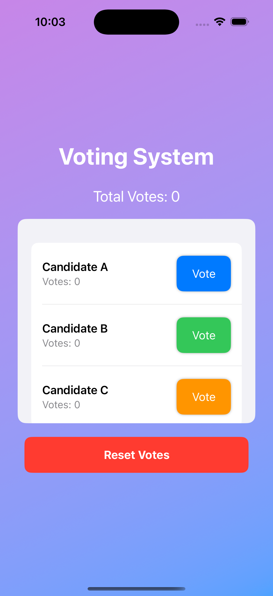
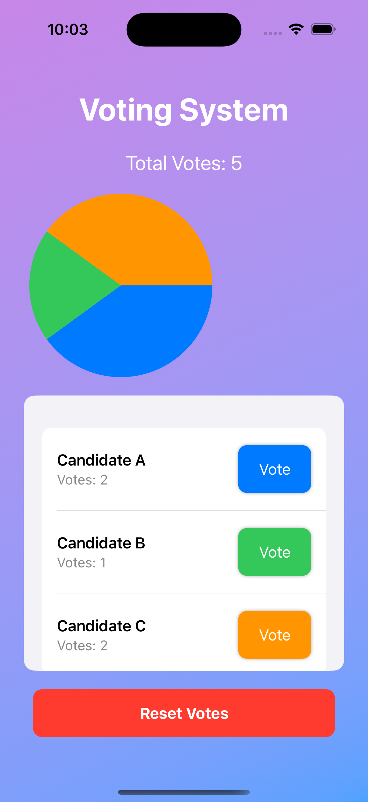
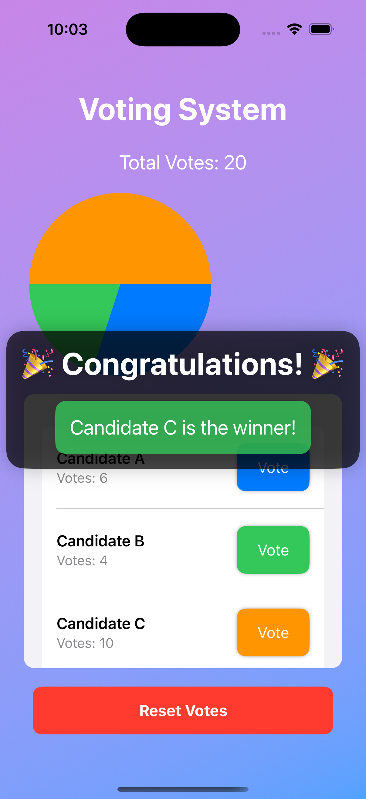
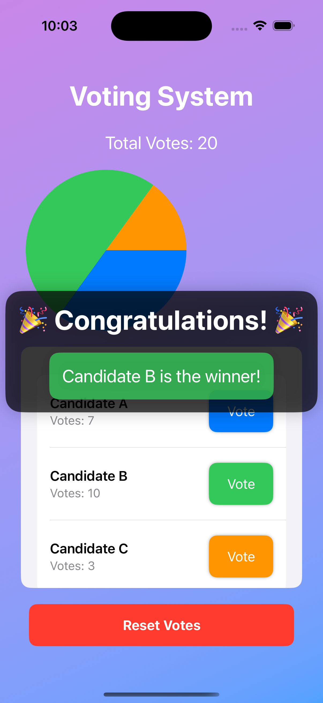

# ID: 2007065
**Name: Forhad Islam Rony**

# Voting System App

This is a simple and interactive **Voting System** app built with **SwiftUI**. It allows users to cast votes for different candidates, view the distribution of votes via a pie chart, and determine the winner when the total votes reach 20.

## Features

### 1. Interactive Voting
- Users can vote for their favorite candidate with a single tap.
- Each candidate's votes are dynamically updated.

### 2. Live Total Votes Display
- Displays the total number of votes cast so far.

### 3. Pie Chart Visualization
- The app includes a pie chart that dynamically represents the percentage of votes each candidate has received.

### 4. Winner Announcement
- Once the total votes reach 20, the app announces the winner with a celebratory pop-up screen.

### 5. Reset Functionality
- Users can reset the votes for all candidates with a single button.

### 6. Smooth Animations
- Includes animations for vote casting and the display of the winner pop-up.

## Screenshots

### Main Interface

### Voting in Progress

### Winner Announcement

## How It Works

1. **Vote Casting**: Tap the "Vote" button for a candidate to cast a vote.
2. **Pie Chart Updates**: Watch the pie chart update dynamically as votes are cast.
3. **Winner Determination**: When the total votes reach 20, the app automatically determines the winner and displays a congratulatory message.
4. **Reset**: Reset all votes by clicking the "Reset Votes" button.

## Installation

1. Clone the repository to your local machine.
2. Open the project in Xcode.
3. Build and run the app on a simulator or a physical device.

## Technologies Used

- **SwiftUI**: For building the user interface.
- **Swift**: Core programming language.
- **Xcode**: IDE for iOS development.
